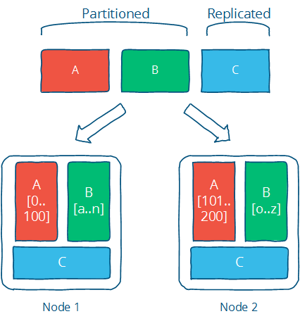

# Distributed systems at a high level

分布式编程主要研究的就是用在一台计算机上用多台计算机解决一个同样的问题。

## 可扩展性（scalability）

[Scalability](http://en.wikipedia.org/wiki/Scalability) is the ability of a system, network, or process, to handle a growing amount of work in a capable manner or its ability to be enlarged to accommodate that growth.

分布式系统首要面临的问题就是数量规模，当计算一个房间人的个数是很简单的一件事，但是当要计算一个国家的人数的时候将会变成一个一件特别难得事情。

可扩展性主要从三个方面出发

* Size scalability: adding more nodes should make the system linearly faster; growing the dataset should not increase latency
* Geographic scalability: it should be possible to use multiple data centers to reduce the time it takes to respond to user queries, while dealing with cross-data center latency in some sensible manner.
* Administrative scalability: adding more nodes should not increase the administrative costs of the system \(e.g. the administrators-to-machines ratio\).

#### 性能（和延迟）performance （and latency） 

主要通过提高下面三个指标，更短的时间延时，更高的吞吐量，更少的使用机器资源

* Short response time/low latency for a given piece of work
* High throughput \(rate of processing work\)
* Low utilization of computing resource\(s\)

系统可以通过处理更大批量的工作来实现更高的吞吐量，从而减少操作开销。由于批处理，权衡对于各个工作的响应时间会更长。也就是说延时和吞吐是一个矛盾体，需要做trade-off

发现低延迟实现较短的响应时间 - 是性能中最有趣的方面，因为它与物理（而非财务）限制有很强的联系。使用财务资源解决延迟比处理性能的其他方面更难。

在分布式系统中，存在无法克服的最小延迟：光速限制了信息传输的速度，并且硬件组件每次操作产生的延迟成本最低（想想RAM和硬盘驱动器以及CPU）。

最小延迟对查询的影响程度取决于这些查询的性质以及信息需要传输的物理距离。

#### 可用性和容错。Availability \(and fault tolerance\) 

可用性指系统无中断地执行其功能的能力，代表系统的可用性程度。

分布式系统使我们能够实现在单个系统上难以实现的理想特性。例如，单个机器无法容忍任何故障，因为它要么失败要么失败。分布式系统可以采用一堆不可靠的组件，并在它们之上构建可靠的系统。

可用性计算公式：Availability = uptime / \(uptime + downtime\)

| Availability % | How much downtime is allowed per year? |
| :--- | :--- |
| 90% \("one nine"\) | More than a month |
| 99% \("two nines"\) | Less than 4 days |
| 99.9% \("three nines"\) | Less than 9 hours |
| 99.99% \("four nines"\) | Less than an hour |
| 99.999% \("five nines"\) | ~ 5 minutes |
| 99.9999% \("six nines"\) | ~ 31 seconds |

**容错** 一旦发生故障，系统就能以明确定义的方式运行

容错归结为：定义您期望的故障，然后设计一个容忍它们的系统或算法。你不能容忍你没有考虑过的错误。

### 什么阻止我们取得好成绩？ 

分布式系统受两个物理因素的限制：

* 节点数量（随着所需的存储和计算能力而增加）
* 节点之间的距离（信息传播，充其量，以光速）

在这些约束下工作：

* 独立节点数量的增加会增加系统故障的可能性（降低可用性并增加管理成本）
* 独立节点数量的增加可能会增加节点之间通信的需求（随着规模的增加而降低性能）
* 地理距离的增加会增加远程节点之间通信的最小延迟（降低某些操作的性能）

超出这些趋势 - 这是物理限制的结果 - 是系统设计选择的世界。

### 设计技巧：分区和复制 

数据集在多个节点之间分配的方式非常重要。为了使任何计算发生，我们需要定位数据然后对其进行操作。

有两种基本技术可以应用于数据集。它可以分割为多个节点（分区）以允许更多并行处理。它还可以复制或缓存在不同的节点上，以减少客户端和服务器之间的距离，并提高容错能力（复制）。

